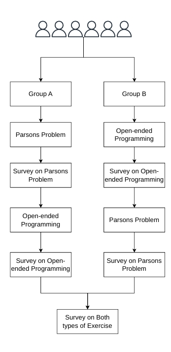

# Towards Mobile Learning: The Tradeoffs of Practicing via Parsons Problem VS Open-ended Programming Exercises

This repository contains the data used to calculate metrics, generate figures, and analyze statistical relationships between variables in the study "Fill-in-the-blank vs Real Programming: A Comparative Analysis to Find Best Approach to Learn Programming."

The dataset directory contains all the necessary data used in the paper.

The irb permission questions data directory contains all the questions used in this experiment.

Python code files contains all the necessary code we needed to formulate the dataset.

The figure below illustrates the structure of our project.

